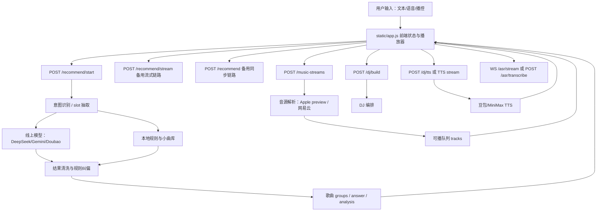
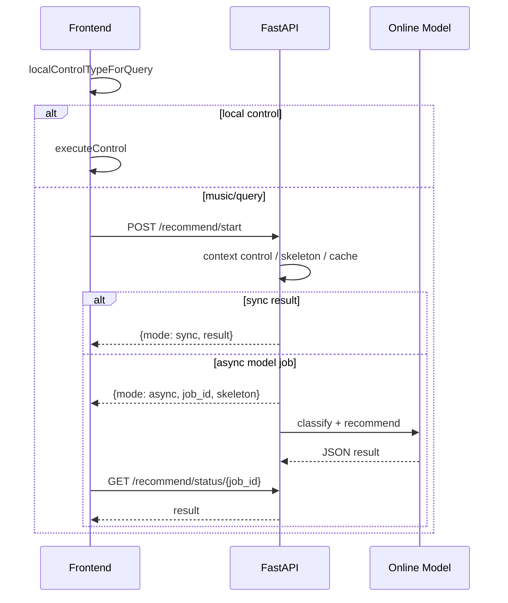
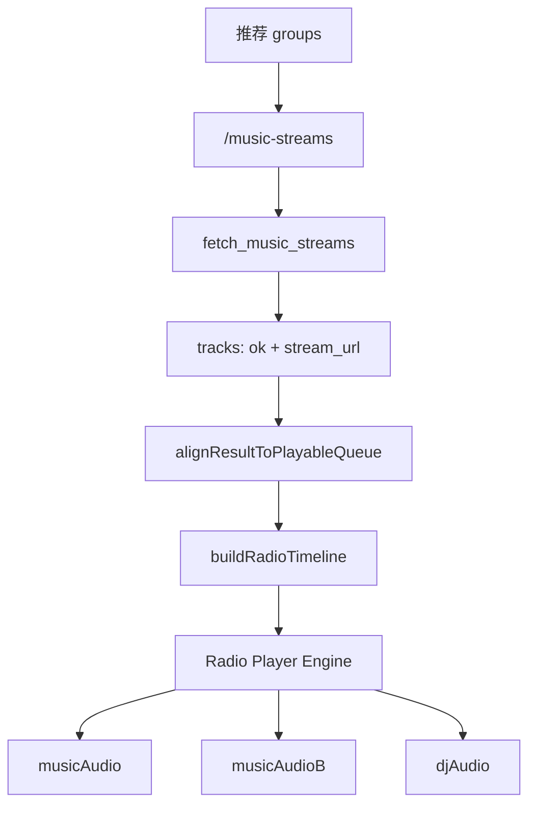
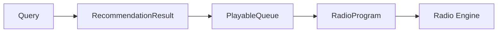

# Melodio Demo 工程架构说明

本文档用于把当前 demo 的工程结构、请求链路和播放链路说明清楚，方便工程同学接手。文档只描述现状和整理建议，不改变现有功能。

## 1. 当前架构概览

当前 demo 是一个单体 FastAPI + 静态前端应用。



核心文件：

| 文件 | 作用 |
|---|---|
| `app.py` | 后端主体：API 路由和主要业务逻辑仍在这里 |
| `core/config.py` | 路径、`.env` 加载、运行时写目录、prompt loader |
| `core/schemas.py` | FastAPI 请求体 Pydantic model |
| `core/asr_protocol.py` | 豆包 ASR 二进制协议常量 |
| `static/app.js` | 前端主体：对话 UI、请求调度、播放器状态机、ASR 输入 |
| `static/index.html` | 页面结构 |
| `static/styles.css` | 页面样式 |
| `prompts/intent_slot_sp.md` | 线上模型意图识别与 slot 抽取提示词 |
| `prompts/recommendation_sp.md` | 线上模型歌曲推荐提示词 |
| `prompts/intent_policy.md` | 意图体系补充说明 |

## 2. 后端模块现状

`app.py` 已先拆出配置、请求模型和 ASR 协议常量，但仍承担主要业务职责：

| 模块 | 代表函数 / 接口 | 当前职责 |
|---|---|---|
| 基础配置 | `core/config.py` | 读取 `.env`，提供路径和 prompt loader |
| 请求模型 | `core/schemas.py` | 定义 `/recommend`、`/music-streams`、`/dj/*`、`/asr/*` 请求体 |
| 模型 provider | `PROVIDERS`, `get_client` | 配置 DeepSeek/Gemini/Doubao |
| 意图识别 | `classify`, `get_online_recommendations`, `skeleton_payload` | 本地规则识别、线上模型识别、slot 归一 |
| 推荐生成 | `build_groups`, `clean_model_payload` | 本地小曲库召回、线上结果清洗、相似推荐修正 |
| 实体记忆 | `ARTIST_ALIASES`, `ARTIST_SIGNATURE_SONGS`, `ARTIST_SIMILARITY_PROFILES` | 别名、代表作、相似艺人画像 |
| 多轮上下文 | `classify_context_control`, `classify_context_reference`, `classify_context_artist_search` | 根据上一轮歌曲和当前播放识别播控/指代 |
| 音源解析 | `fetch_configured_music_stream`, `fetch_music_streams`, `/music-streams` | 把歌曲转成可播放 preview/stream |
| DJ 编排 | `attach_dj_response`, `call_llm_dj_service`, `/dj/build` | 生成 DJ 开场/串场结构 |
| TTS | `attach_tts_to_dj`, `/dj/tts`, `/doubao-tts/stream`, `/minimax-tts-ws/stream` | 把 DJ 文本转音频 |
| ASR | `/asr/stream`, `/asr/transcribe` | 豆包实时 ASR，Gemini 录音兜底 |
| 网易云登录 | `/netease-login/*`, `/netease-auth-status` | 二维码登录、cookie 保存、可播检测 |

## 3. 主要请求链路

### 3.1 文本推荐 / 搜索链路

前端入口：`recommend(query)`。

当前优先级：

1. 前端先做轻量播控识别：`localControlTypeForQuery`
2. 命中播控时，不调用模型，直接执行本地播放器控制
3. 非播控时调用 `/recommend/start`
4. `/recommend/start` 先返回同步结果或异步 job
5. 异步 job 通过 `/recommend/status/{job_id}` 轮询
6. 如果异步失败，前端降级到 `/recommend/stream`
7. 如果流式失败，再降级到 `/recommend`



### 3.2 推荐结果到播放链路

推荐接口返回的是 `groups`，还不是最终播放队列。前端会再调用 `/music-streams` 把歌曲解析成可播放 tracks。

当前播放链路：

1. 推荐结果返回 `groups`
2. 前端 `prefetchRadioStreams(data)` 预取音源
3. 自动起播时调用 `startRadio(data, root)`
4. `startRadio` 内部请求 `/music-streams`
5. 后端 `fetch_music_streams` 并行解析歌曲
6. 前端 `buildRadioTimeline(data, tracks)` 把可播歌曲和 DJ 段落组成 timeline
7. 前端用 `musicAudio/musicAudioB/djAudio` 三个 audio 元素播放



### 3.3 DJ 异步链路

当前设计是：音乐可以先播，DJ 后生成并插入。为了避免 DJ 提到不可播歌曲，前端会等待可播队列 ready 后再触发 `/dj/build`。

链路：

1. 推荐结果里可能带 `dj.pending=true`
2. 可播队列 ready 后，前端调用 `/dj/build`
3. 后端生成 DJ segment，但不一定生成音频
4. 前端调用 `/dj/tts` 生成语音
5. DJ audio ready 后，前端在播放中 overlay 或排入 timeline

## 4. 前端状态结构

`static/app.js` 里有两个关键状态对象：

| 状态 | 作用 |
|---|---|
| `chatState` | 保存对话历史、上一轮推荐、当前歌曲、是否自动起播 |
| `radioState` | 保存播放器状态、timeline、audio 元素、DJ 队列、当前播放 index |

`radioState` 的核心音频对象：

| 字段 | 作用 |
|---|---|
| `musicAudio` | 音乐主轨 A |
| `musicAudioB` | 音乐主轨 B，用于切歌/预备 |
| `djAudio` | DJ 语音轨 |
| `activeMusic` | 当前实际播放的音乐 audio |
| `timeline` | 已解析后的播放时间线，包含 music 和 voice |
| `index` | 当前 timeline 位置 |
| `playToken` | 防止异步播放回调串台 |

## 5. 数据契约

### 5.1 推荐结果

```json
{
  "query": "适合深夜开车的华语歌",
  "provider": "deepseek",
  "analysis": {
    "domain": "content_reco",
    "intent": "filtered_reco",
    "entity_type": "unknown",
    "action": "recommend",
    "reference": "适合深夜开车的华语歌",
    "target_entity": {"name": "", "artist": "", "album": ""},
    "traits": ["深夜", "开车", "伤感", "华语"]
  },
  "answer": "",
  "entities": [],
  "groups": [
    {
      "title": "推荐结果",
      "songs": [
        {"title": "一路向北", "artist": "周杰伦", "reason": "..."}
      ]
    }
  ],
  "dj": {
    "pending": true,
    "segments": []
  }
}
```

### 5.2 音源解析结果

```json
{
  "tracks": [
    {
      "ok": true,
      "requested_index": 0,
      "requested_title": "一路向北",
      "requested_artist": "周杰伦",
      "title": "一路向北",
      "artist": "周杰伦",
      "stream_url": "https://...",
      "provider": "apple_music",
      "image_url": "https://..."
    }
  ]
}
```

### 5.3 DJ segment

```json
{
  "segments": [
    {
      "type": "speech",
      "position": "before_track",
      "trackIndex": 0,
      "speech_text": "这首先从夜路的速度感切进去。",
      "audio": "/doubao-tts/stream?..."
    }
  ]
}
```

## 6. 当前工程问题

### 6.1 单体文件过大

`app.py` 同时包含配置、意图、推荐、音源、DJ、TTS、ASR、登录、API 路由。功能已经跑通，但工程边界不清晰，后续多人协作容易互相影响。

### 6.2 播放链路跨前后端耦合较强

当前 `groups -> tracks -> timeline -> playback` 的关键逻辑主要在前端。后端只返回推荐和音源解析结果，没有一个明确的 `PlayableQueue` 数据结构作为边界。

### 6.3 DJ 和可播队列的契约不够显式

现在靠前端 `alignDjToPlayableTracks` 过滤 DJ segment，避免 DJ 提到不可播歌曲。更清晰的边界应该是：DJ 只消费最终可播队列。

### 6.4 音源解析不是独立服务

`fetch_music_streams` 已经是接近 resolver 的形态，但还混在 `app.py` 内。缓存、匹配策略、失败原因、可播置信度都没有独立结构化。

### 6.5 播放器状态机需要模块化

`static/app.js` 里播放器、对话、ASR、请求调度都在同一个文件。当前能跑，但切歌、续播、DJ overlay、自动起播这类问题容易反复互相影响。

## 7. 不改功能前提下的架构清晰化建议

下面这些是工程整理建议，目标是让边界清楚，不改变产品行为。

### 7.1 后端按模块拆文件

建议目录：

```text
melodio_demo_clone/
  app.py                       # 只保留 FastAPI app 初始化和路由注册
  api/
    recommend.py               # /recommend/start /recommend /recommend/stream
    playback.py                # /music-streams /music-player /netease-login/*
    dj.py                      # /dj/build /dj/tts /tts/*
    asr.py                     # /asr/stream /asr/transcribe
  core/
    schemas.py                 # Pydantic request/response model
    config.py                  # env 配置
    providers.py               # LLM client
  music/
    intent.py                  # classify / context classify
    recommendation.py          # build_groups / clean_model_payload
    entity_memory.py           # aliases / signatures / similarity profiles
    resolver.py                # fetch_music_streams / Apple / 网易云
  dj/
    planner.py                 # DJ segment 生成
    tts.py                     # 豆包/MiniMax TTS
  asr/
    doubao.py                  # 豆包 ASR 协议
```

### 7.2 前端按职责拆文件

建议目录：

```text
static/
  app.js                       # 只做启动和事件绑定
  js/
    api.js                     # fetch 封装
    chat-state.js              # chatState
    radio-engine.js            # radioState + 播放状态机
    radio-timeline.js          # groups/tracks/dj -> timeline
    voice-input.js             # ASR
    render.js                  # UI 渲染
    controls.js                # 播控识别和执行
```

### 7.3 明确三个核心边界对象

建议把当前隐式结构命名成三个稳定对象：

1. `RecommendationResult`
   - 模型/规则返回的意图和候选歌曲
2. `PlayableQueue`
   - 经过音源解析和可播过滤后的队列
3. `RadioProgram`
   - 可播队列 + DJ segment + 播放策略

理想边界：



### 7.4 新增工程注释和接口快照

不改行为的情况下，可以先加：

- `docs/api-contracts.md`
- `docs/playback-state-machine.md`
- `docs/env-vars.md`
- `docs/demo-known-limits.md`

这样工程同学不用读完整代码也能知道接口怎么调用、状态怎么流转。

## 8. 给工程同学的接手顺序

建议按这个顺序看：

1. `static/app.js` 的 `recommend`、`handleFinalRecommendation`、`startRadio`
2. `app.py` 的 `/recommend/start`、`get_online_recommendations`、`clean_model_payload`
3. `app.py` 的 `/music-streams`、`fetch_music_streams`
4. `static/app.js` 的 `buildRadioTimeline`、`playTimelineItem`、`executeControl`
5. `app.py` 的 `/dj/build`、`/dj/tts`
6. `static/app.js` 的 `hydrateDjProgram`、`hydrateDjTts`

## 9. 结论

当前 demo 的功能已经覆盖了自然语言音乐理解、推荐、可播解析、DJ 编排、TTS、ASR 和多轮播控，但实现上仍是一个快速迭代形成的单体 demo。

如果只是给工程同学导出，不建议马上重写功能。更稳的做法是：

1. 先把 `RecommendationResult / PlayableQueue / RadioProgram` 三个边界写清楚。
2. 再把后端按模块拆文件。
3. 最后把前端播放器抽成 `radio-engine.js`。

这样不改变现有能力，但工程结构会清晰很多，也能减少后续播放问题反复回归。
